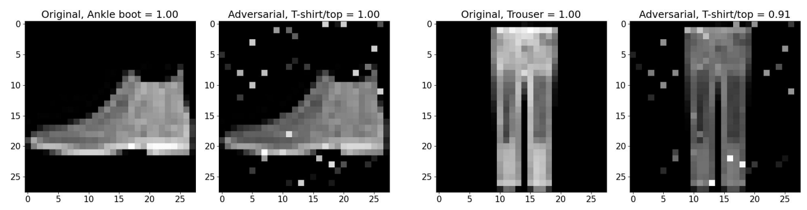

# Adversarial Attacks via Genetic Algorithm

The goal is to force a convolutional NN to classify an object into a specific class.
Genetic algorithm is used to perform the search for noise that has to be applied to the image
to make the model classify it with a specific label.

The following image demonstrates the change in the predicted label by the CNN model after 
adding pertrubations to certain pixels:



## CNN Model
A simple CNN was trained on the Fashion MNIST dataset to classify the images into 10 classes.
The model is used as a black box. It consists 622 thousand trainable parameters. It reached 90% accuracy
on the test split of the dataset.

## Algorithm 
* The algorithm is inspired by the POBA-GA paper [1]
* The implementation PyGad library's implementation of the genetic algorithm was used.
* Only a subset of 100 dataset images is used to find the target pattern due to computational complexity.
* The population consists of a set of 2D images containing the changes (noise) that are
added to the training images in the fitness function
* Fitness function: Fitness = 1 / (loss + α * perturbation\_size)

[1] J. Chen, M. Su, S. Shen, H. Xiong, and H. Zheng. POBA-GA: perturbation optimized black-box adversarial attacks via
genetic algorithm. CoRR, abs/1906.03181, 2019. URL http://arxiv.org/abs/1906.03181.

## Experiments results

The results of the experiments can be found in the [slides](docs/presentation.pdf) or the [report](docs/report.pdf).

## How to run
Prepare environment:
```
conda env create -f environment.yml
conda activate evo
pip install pygad
```
Export path to the project root directory:
```
export PYTHONPATH="${PYTHONPATH}:<PROJECT_DIR>"
```
### Run experiments

```
python3 src/experiments/runner.py
```

### Display plots from experiments

```
python3 src/experiments/plots.py
```


